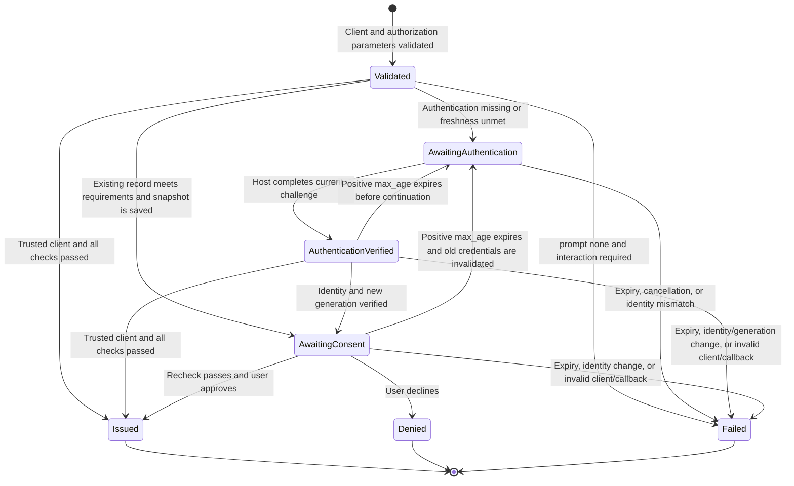

# OIDC authentication freshness in 2.0.0

[English](authentication-freshness-2.0.md) | [简体中文](zh-CN/authentication-freshness-2.0.md)

**Status: Proposed; target package release: 2.0.0.** Product requirements are fixed; the API signatures and internal adapters below still need verification. See the [v1.2.2 upgrade guide](upgrading-to-1.2.2.md) for current behavior.

The single goal of 2.0.0 is to make `auth_time`, `max_age`, and reauthentication reflect a real authentication event. The package cannot infer that event from a Laravel `Login` event, a remember cookie, session creation, or `setUser()`. Hosts must implement explicit authentication notification and a reauthentication entry point. Every authorization-code transaction managed by the package requires a trustworthy authentication record; an unknown time requires authentication, or `login_required` when `prompt=none` forbids interaction.

## Scope and terms

- **Authentication record:** server-side session data bound to a guard, concrete model class, user ID, actual authentication time, and a random generation changed on each real authentication.
- **Authorization transaction:** one validated RP request, including its original nonce, state, PKCE values, client, callback, consent state, and freshness requirements.
- **Reauthentication challenge:** a random, expiring, single-use challenge bound to that transaction and, when known, its original user.
- **Authentication generation:** proof that two successful authentications differ even if they occur during the same second. A different generation alone does not prove that this transaction's challenge was satisfied.
- **Freshness checkpoint:** the decision before consent or code issuance that the transaction's requirements are still met.

This release does not introduce cross-model identity mapping, a separate ID Token TTL, new consent or logout switches, or unrelated Passport refactoring. It retains existing code/S256, nonce, identity, default consent, and token-endpoint protections. Authentication proof comes from explicit host notification and the server-side session, not in-process object identity.

## Host contract

These method signatures are drafts to verify:

```php
interface AuthenticationRecorder
{
    public function markAuthenticated(
        string $guard,
        Authenticatable $user,
        ?DateTimeImmutable $authenticatedAt = null,
        ?ReauthenticationChallenge $challenge = null,
    ): AuthenticationRecord;

    public function current(string $guard): ?AuthenticationRecord;

    public function forget(string $guard): void;
}

interface ReauthenticationHandler
{
    public function redirect(
        Request $request,
        ReauthenticationChallenge $challenge,
    ): RedirectResponse;
}

interface ReauthenticationService
{
    public function challenge(
        Request $request,
        string $transactionId,
        string $challengeToken,
    ): ReauthenticationChallenge;

    public function complete(Request $request, ReauthenticationChallenge $challenge): RedirectResponse;
}
```

The host calls `markAuthenticated()` after all required factors succeed. When `authenticatedAt` is omitted, the package records the call time. An upstream SSO time must be verified; silent restoration is not a new authentication. The package checks that the selected guard holds the reported user. Reauthentication supplies this transaction's challenge, and logout clears only the affected guard's record and unfinished transactions.

For a challenge, the reported authentication time must be no earlier than challenge creation and no later than the server's recording/completion time. Equality within the same second is allowed only with a new generation and proof for this challenge. A signed upstream assertion containing an older authentication time cannot satisfy the challenge merely because the recorder produces a new generation; do not replace that time with callback receipt time or adjust it to conceal clock disagreement.

The following sketch shows the host's completion order. `hostAuthenticator` and its result represent the host's existing authentication implementation, not package APIs. The result carries the authenticated user and the actual, verified authentication time:

```php
$challenge = $reauthentication->challenge($request, $transactionId, $challengeToken);
$authentication = $hostAuthenticator->authenticateForChallenge($request, $challenge);
$user = $authentication->user;
// The selected authentication method and all required factors have succeeded.
Auth::guard($challenge->guard)->login($user);
$request->session()->regenerate(true);
$recorder->markAuthenticated(
    guard: $challenge->guard,
    user: $user,
    authenticatedAt: $authentication->authenticatedAt,
    challenge: $challenge,
);

return $reauthentication->complete($request, $challenge);
```

The host entry point retains CSRF protection and failed-attempt limits. `challenge()` resolves the guard, identity, and requirements from server-side transaction state; `complete()` only consumes a recorded proof for the current challenge. Cancellation ends this transaction.

## Session and encrypted context

Store authentication records and unfinished transactions as serializable values in the server-side session, indexed by guard and random transaction ID respectively. Each transaction holds the original request, identity constraint, freshness requirements, expiry, and one-time challenge, approval, and continuation credentials. Do not store passwords, MFA secrets, or upstream assertions. An old session without a package authentication record has unknown authentication time.

Illustrative session shape (the exact key names are part of the implementation design):

```json
{
  "oidc": {
    "freshness": {
      "schema": 1,
      "session_binding": "<random>",
      "authentications": {
        "member": {
          "guard": "member",
          "model": "App\\Models\\Member",
          "user_id": "123",
          "auth_time": 1790200000,
          "generation": "<previous-generation>"
        }
      },
      "transactions": {
        "<transaction-id>": {
          "state": "awaiting_authentication",
          "created_at": 1790200010,
          "expires_at": 1790200610,
          "session_binding": "<random>",
          "authorization": {
            "client_id": "<validated-client-id>",
            "redirect_uri": "https://rp.example/callback",
            "response_type": "code",
            "scope": "openid profile",
            "state": "<exact-original-state>",
            "nonce": "<exact-original-nonce>",
            "code_challenge": "<original-S256-challenge>",
            "code_challenge_method": "S256"
          },
          "requirements": { "max_age": 0, "prompts": ["login"] },
          "guard": "member",
          "expected_identity": ["member", "App\\Models\\Member", "123"],
          "expected_subject": "<validated-subject>",
          "baseline_generation": "<previous-generation>",
          "challenge": {
            "id": "<random>", "token_hash": "<hash>",
            "issued_at": 1790200010, "expires_at": 1790200310
          },
          "authentication_snapshot": null,
          "verified_authentication": null,
          "approval_token_hash": null,
          "resume_token_hash": null
        }
      }
    }
  }
}
```

Field names and lifetimes are illustrative. `session_binding` survives session ID rotation but does not replace challenge proof. Every transaction records the selected guard. For an authenticated user, bind `expected_identity` and `expected_subject` when creating the transaction. For a guest, those two fields remain null until the first successful challenge binds the authenticated identity once; later account changes cannot replace it.

`authentication_snapshot` is the single snapshot of authentication time and generation used for consent and final approval. When the current record already meets the requirements, copy it without creating a challenge or changing its time/generation; `verified_authentication` remains null. After challenge completion, `verified_authentication` contains only `{challenge_id, generation}`: the challenge ID must match this transaction's current challenge, and the generation must match both the snapshot and the current guard's authentication record. Do not duplicate time or identity in that proof. Both paths require a non-null snapshot before code issuance, and the challenge path additionally requires the matching proof. Approval and continuation credentials are single-use. Transactions and concurrent transaction counts need limits, with values verified during implementation.

The encrypted context uses the internal format marker `oidc.v=3`; this release accepts only the integer `3`. Missing markers, other values, and other types (including the string `"3"`) return `invalid_grant`. The marker selects the meaning of the data; it does not prove authentication. Authenticate/decrypt the envelope and strictly validate its permitted keys, required fields, types, and identity bindings even when the marker matches. Do not add legacy parsers, format conversion, or version negotiation.

The context carries only the original nonce, bound identity/client/issuer/subject, and the verified authentication event (`auth_time` and generation). Authorization requirements, the transaction ID, challenge proof, and freshness checks remain in the server-side issuance flow. They are not copied into refresh tokens as unused audit fields or derived success flags. Only the checked issuance path may create this context; extra fields need a demonstrated validation purpose before being added.

Illustrative `oidc` envelope after completing the challenge above: authentication occurs at `1790200012` with a new generation, and the final authorization check occurs at `1790200015`.

```json
{
  "v": 3,
  "nonce": "<original-nonce-or-null>",
  "identity": ["member", "App\\Models\\Member", "123"],
  "client_id": "<validated-client-id>",
  "iss": "https://op.example",
  "sub": "<validated-subject>",
  "authentication": { "auth_time": 1790200012, "generation": "<new-generation>" }
}
```

Issued material must contain non-null `authentication`, `auth_time`, and `generation`. A pending session transaction may temporarily have a null `authentication_snapshot`; a transaction requiring authentication must also obtain non-null `verified_authentication` before issuing a code. Reusing an already sufficient record does not require or fabricate challenge proof.

The authenticated event is frozen when the code is issued and retained through refresh rotation. Token requests cannot submit or replace its time, generation, identity, or nonce. Code exchange and refresh do not read the current browser session or reapply the original `max_age` against the current time. They check the encrypted context and the code/refresh token's own expiry, revocation, client, and identity rules. A new ID Token from refresh uses the original `auth_time`, a new `iat`, and no `nonce`; the original nonce may remain inside the encrypted context but is not returned as an ID Token claim or plaintext token-response field.

All codes from package-managed authorization-code transactions and their refresh tokens carry this authentication context. The package-managed token endpoint requires it for `authorization_code` and `refresh_token`, regardless of `openid`; every returned ID Token must contain a real `auth_time`. Requesting `openid` alone does not give another grant an authentication transaction or an ID Token.

| Grant or entry point | Scope of this release |
| --- | --- |
| Authorization code and its refresh, with or without `openid` | Require the common authentication contract and context. Without `openid`, return OAuth tokens only; context validation still applies. |
| `client_credentials` | Retain OAuth client authentication without requiring a user session or authentication event; never return an ID Token. |
| Passport personal access token factory | Remains host-managed and outside this browser authentication contract; do not add an ID Token or a session requirement. |
| Password, device, or custom user grants without the package authorization transaction | Do not add freshness integration for these grants in 2.0.0. Reject them at package-managed token endpoints with `unsupported_grant_type` before issuance, rather than returning a context-free refresh that those endpoints will reject. Hosts retaining these flows must use a separately configured OAuth server and endpoint with their own issuance/refresh policy. |

Retained Passport aliases use the same package policy; another URL using the same protected server is not an isolated OAuth integration. Any old or context-free code/refresh presented to a package-managed endpoint still returns `invalid_grant`; the host boundary is not a legacy compatibility branch.

Same-host OAuth isolation requires a verified integration recipe for both Passport versions. The current provider uses a global Passport response setting and `afterResolving(AuthorizationServer::class)`; a different container binding or a subclass may still receive package configuration. The first prototype must isolate controller routing, the server instance, grant registration, and response type, and prove that package endpoints retain their checks. Do not present a second endpoint/server as a working recipe before that verification, or build a general multi-server framework to provide it.

## Authorization flow

1. Validate the client, registered callback, response type, scopes, and S256 challenge before redirecting an error or creating a transaction. Parse OIDC parameters without losing the exact nonce or state; reject duplicates, normalized aliases, malformed `max_age`, and invalid prompt combinations.
2. Create a transaction for the validated request and selected guard before choosing the authentication path. Bind the current user's identity and subject when present. Check the guard's explicit record: a missing record, record/user mismatch, or age exceeding the requested limit requires authentication; omitting `max_age` does not bypass the check. `prompt=login` and `max_age=0` require a newly completed challenge for this transaction, even if the current record was written in the same second. With `prompt=none`, return `login_required` or `consent_required` if interaction is needed, without creating a challenge.
3. If the record is sufficient, save its authentication snapshot and proceed directly to the consent decision in step 5. Otherwise create a random challenge and redirect to the configured host handler. The browser carries only opaque transaction/challenge locators; the host cannot supply an arbitrary callback or altered authorization parameters.
4. After real authentication succeeds, the host preserves other guards, rotates the session, calls `markAuthenticated()` with this challenge, and invokes completion. For a previously bound user, require the same identity; for a guest transaction, bind the first successful identity and subject once. Completion checks the transaction, guard, identity, challenge, expiry, new generation, and authentication-time ordering, then consumes the challenge, stores the authentication snapshot and its challenge proof, and returns to a package-owned continuation route.
5. Use or resume the original transaction and obtain consent under the existing policy. On continuation and immediately before code issuance, revalidate that the client is active and the exact original callback is still registered. If either check fails, end the transaction locally; do not send a code or error to a removed callback. A trusted client's explicit consent skip remains possible, but never skips these checks or freshness. Before issuing a code, compare the current identity/generation with the snapshot and recalculate positive `max_age`: consent waiting can make authentication too old. Previously satisfying `prompt=login` or `max_age=0` does not bypass these remaining checks.
6. For authorization-code exchange and refresh at package-managed endpoints, validate the context before creating an access token, refresh token, or ID Token. Retain League's client authentication, callback, verifier, expiry, and revocation checks. Validate refresh context before revoking the old refresh token or persisting a replacement. Other grants follow the scope table above.

`Issued`, `Denied`, and `Failed` are terminal; challenge and approval credentials cannot be consumed again:



When a positive `max_age` expires before continuation or during consent, issue another challenge only within the transaction's lifetime; otherwise the RP restarts authorization. Entering a new challenge invalidates the previous challenge, approval, and continuation credentials, clears the old authentication snapshot/proof, and records the current baseline generation. Do not extend the transaction's expiry. After completion, save the new snapshot and re-display any required consent with a new approval credential bound to it; old forms must fail both before and after the new authentication.

A completed challenge does not cause another challenge solely because the request contains `max_age=0` or `prompt=login`. Positive `max_age`, transaction expiry, and identity/generation checks still apply. In particular, `prompt=login&max_age=60` requires authentication again if consent waits beyond 60 seconds after that authentication.

| Request | Required behavior |
| --- | --- |
| No freshness parameter, known time | Normal consent policy; initial ID Token uses the real `auth_time`. |
| No freshness parameter, unknown time | Authenticate before consent; return `login_required` with `prompt=none`. |
| `max_age=N`, N > 0 | Accept only when the actual age is at most N, including at code issuance; otherwise actively reauthenticate. |
| `max_age=0` or `prompt=login` | Require a new authentication satisfying this transaction's challenge, distinguished by generation even in the same second. |
| `prompt=login` together with positive `max_age` | Satisfy both requirements; a completed login challenge does not waive the age check at continuation or code issuance. |
| `prompt=login consent` | Present consent after reauthentication for this transaction. |
| `prompt=consent` | Require consent; it does not itself create a new authentication time. |
| `prompt=none` with authentication needed, including `max_age=0` | Return `login_required` without interaction. |
| `prompt=none` with consent needed | Return `consent_required` without interaction. |
| `prompt=none` combined with another prompt | Return `invalid_request`. |
| Essential ID Token `auth_time` requested | Return the real time under the common authentication contract; an unknown time requires authentication, or `login_required` if interaction is forbidden. |
| Code exchange or refresh after the original `max_age` interval | Do not reapply that interval; validate the context and the credential's own expiry/revocation and binding rules. |
| Refresh with a proven authentication time | Preserve that time, issue a new `iat`, and omit nonce. |

Malformed, negative, fractional, empty, duplicated, or overflowing `max_age` values are invalid. Support valid nonnegative decimal representations including leading zeros. Unsupported `auth_time` claim qualifiers must not cause the server to invent or change the actual time; fix their accepted syntax and behavior in the first implementation prototype.

## Replay, concurrency, and failures

Separate transactions allow multiple tabs without mixing nonce, state, PKCE, consent, or challenges. A new authentication generation may invalidate an older tab's consent decision; that tab must re-evaluate or restart rather than borrow another transaction's proof. A pending transaction cannot change its bound guard, model, ID, or subject. After code issuance, a browser account switch, logout, or lost session does not change the code's original identity. Redemption still verifies that the original user exists and its model/subject and the server's issuer/guard/provider mapping match the encrypted binding; a mismatch returns `invalid_grant` for code or refresh.

Use shared session storage and session blocking for authorization, resume, approval, denial, and host completion. Session locks are keyed by session ID in Laravel, so test old-ID requests across session regeneration and delayed saves. Add narrowly scoped atomic consumption markers for challenges and code issuance if required to prevent an old session snapshot from consuming a transaction twice. Serializing a token's redemption must cover League's check, persistence, and revocation, not only a preliminary middleware check. If a required lock is unavailable, issuance fails closed.

Acquiring a lock is not enough: its lease may expire while the request is still running. The implementation must keep exclusivity throughout the critical section or use atomic consumption that prevents duplicate progress after lock loss; the exact mechanism needs a prototype. Consumption markers must survive the relevant replay window. Inject lease expiry, premature marker expiry/loss, and a node stopping after consumption in separate-process tests. When the required storage or consumption guarantees cannot be established, stop issuance rather than treating missing state as an unused credential.

| Failure | Observable result and boundary |
| --- | --- |
| Client or callback has not been validated | Local protocol error; never redirect to a request-supplied URI. |
| Client revoked or original callback removed while authentication/consent is pending | Fail continuation or approval locally; never send a code or error to the removed callback. |
| Invalid challenge, resume, or approval credential | Reject locally without using a submitted callback or deleting another tab's transaction. |
| Session or transaction missing or expired | Require RP reauthorization; redirect an error only if the original validated transaction still exists. |
| Browser user changes or its session ends | A pending transaction cannot continue with a different user or missing session; an issued code is independent of that browser session and still validates its original identity. |
| Original user is deleted, its model/subject changes, or the server issuer/guard/provider mapping no longer matches | End affected pending transactions; code/refresh returns `invalid_grant` before token issuance or refresh revocation. |
| Authentication time is in the future or node clocks disagree | Do not treat a negative age as zero; reject the freshness proof. |
| Reported authentication predates the current challenge | Reject challenge completion even with a new generation; do not rewrite the time. |
| Required shared lock is unavailable | Stop issuance rather than falling back to an unlocked path. |
| Code or refresh has an old format, missing authentication proof, malformed data, or a different identity | Return `invalid_grant` before persisting new tokens or revoking a refresh token. |
| Host reauthentication handler is not configured | Return an integration error; do not fall back to Passport's native `prompt=login`, which can clear the shared session. |

## Upgrade and cutover

2.0.0 adopts the new authentication contract without converting old authorization materials or retaining a legacy refresh path. Hosts must implement the new integration. RPs must start authorization again when old material returns `invalid_grant`.

| Material or session state | 2.0.0 behavior |
| --- | --- |
| Old session or remember restoration without a trustworthy record | Complete real authentication in a new authorization transaction; never infer or manufacture the original authentication time. |
| Pending v1.2.2 consent | Restart authorization; do not convert the pending page. |
| Old authorization code or refresh token at package-managed endpoints, including material without the new authentication context | Return `invalid_grant` without issuing a replacement token; the RP starts authorization again. |
| Current format with missing, null, or invalid authentication time or generation | Return `invalid_grant` without issuing any token. |
| Code or refresh with valid current context | Redeem or refresh under the new contract; any returned ID Token uses the original `auth_time`, with no nonce on refresh. |
| Unknown format or malformed context | Return `invalid_grant`; do not accept it as legacy or context-free material. |
| Already issued access or ID token | Deployment does not revoke it automatically; existing expiry and revocation rules apply. |

No database migration is planned. Before cutover, deploy host authentication hooks and the reauthentication entry point, and verify that RPs restart authorization after `invalid_grant`. Drain old authorization/token requests, then switch all nodes together without mixing worker versions. Coordinate shared sessions/locks, keys, clocks, published views, route/config caches, and long-lived workers. The final upgrade guide must state the authentication and reauthorization requirements and the grant boundaries above.

Rollback also drains issuance and switches the whole fleet. Returning to v1.2.2 loses authentication-freshness capability as well as access to the new context: v1.2.2 rejects `max_age` and Essential `auth_time` requests and does not return a trustworthy authentication time. Reauthorization alone cannot restore service for RPs requiring these guarantees. Prefer forward repair; while rolled back, stop affected flows explicitly rather than removing freshness requirements or relabeling context. RPs holding unreadable material need new authorization only once a server capable of satisfying their requirements is available.

Format rejection does not revoke database token records. If the old token endpoint is reopened after rollback, still-valid, unrevoked old refresh tokens may work again. The rollback gate must therefore cover old refresh retries as well as new authorization for affected clients. Keep an unrevoked old-format sample in the rollback exercise and verify that no token is issued while this gate is closed. Permanent invalidation would require a separately authorized revocation operation; do not assume deployment already performed it.

| Boundary | Known difference and proposed handling |
| --- | --- |
| Passport 12/13 authorization controller | Constructor and `authorize()` signatures differ; the package orchestrates its own transactions without inheriting unstable parent methods. |
| Pending approval and current user | The versions store pending requests and resolve users differently; store scalar transactions and use the selected guard explicitly. |
| `prompt=none` | Native errors differ; normalize to `login_required` for insufficient authentication and `consent_required` for missing consent. |
| League 8/9 | Verify grant, encryption/decryption, and response method signatures separately; validate context before issuance and revocation. |
| Host OAuth isolation | Verify controller/server/grant/response isolation against global provider hooks on Passport 12 and 13 before documenting a supported recipe. |
| Supported combinations | Laravel 11/12 with Passport 12/13; Laravel 13 with Passport 13. Check PHP versions against each combination's Composer constraints. |

## Implementation and acceptance gates

The main ownership boundaries are the existing `AuthorizationContext` (parameter and context validation), `AuthorizationController` (authorization, consent, and continuation), `EnforceAuthorizationPolicy` (entry-point enforcement), `Bridge/AuthCodeGrant` (code envelope and pre-issuance checks), `TokenResponseType` and `IdTokenService` (refresh context and ID Token claims), and `OidcServerServiceProvider` (registration). Add focused recorder, transaction store, reauthentication service, and refresh-grant adapters. The package routes and consent view must carry the transaction without accepting replacement authorization parameters. All retained Passport authorization/token aliases need the same protection.

The first prototype should check final transaction/challenge conditions before the parent grant's `completeAuthorizationRequest()`, because League persists the code before calling `encrypt()`. For exchange, verify the code-decryption hook and the post-parent `validateOldRefreshToken()` hook, including their Passport/League signatures and `invalid_grant` exception mapping. Store the validated request-local result for response generation; response encryption and ID Token generation consume it rather than introducing known-invalid-context failures after token persistence or refresh revocation. This does not promise automatic rollback for later signing, process, or transport failures.

| Phase | Main areas | Gate | Main risk |
| --- | --- | --- | --- |
| 1. Verify contracts and extension points | API/context sketches, Passport 12/13 and League 8/9 controller, grant, and response methods | Prototypes reject bad context before persistence/revocation, preserve error mapping, and prove any host OAuth isolation recipe. | Validation occurs too late, signatures differ, or global hooks defeat isolation. |
| 2. Record real authentication | Host contracts, session recorder, guard lifecycle | Password/SSO/MFA completion, remember restoration, same-second generations, and Member/Admin isolation pass. | Framework login is mistaken for real authentication. |
| 3. Bind transactions | Transaction store, handler, challenge completion, session rotation | Snapshots and guest binding work; wrong identity/transaction, replay, expiry, old session IDs, expired lock leases, and lost consumption markers fail safely. | Concurrent consumption or stale sessions issue twice. |
| 4. Enforce authorization freshness | Authorize/approve/deny/continue, consent view, policy middleware | Combined login/age checks, consent waiting, and client/callback revalidation pass; reauthentication invalidates old forms; trusted clients cannot bypass checks. | Middleware redirects first or issuance uses stale authentication or registration. |
| 5. Use one context format | Auth code and refresh grants, response type, ID Token service | New-format exchange and refresh pass with or without `openid`; old material and missing proof are rejected before issuance; other grants obey the scope table. | Validation occurs after side effects, accepts old material, or issues unusable refresh tokens. |
| 6. Cover cleanup and integration boundaries | Logout, Discovery, manual configuration, retained Passport routes | Clear records per guard; every alias uses the same policy. | Admin state is cleared or an alternate route bypasses checks. |
| 7. Verify real integration | Laravel/Passport matrix, real host, independent RP, concurrent processes | Supported combinations, a real RP, and cross-node fault injection pass, including lease expiry and a node stopping after consumption. | Test doubles hide session, SSO, or race behavior. |
| 8. Prepare migration and release | English/Chinese docs, host/RP integration, coordinated rollout and rollback exercises | RPs reauthorize on 2.0.0; rollback gates stop freshness-dependent flows and retries of still-unrevoked old refresh tokens. | Reauthorization is mistaken for restored capability, or old material becomes usable after rollback. |

Commit tests with the phase they cover. Concurrent acceptance tests must use separate processes; sequential requests do not prove replay safety.

| Layer | Observable acceptance cases |
| --- | --- |
| Unit | No recorder call means no authentication proof; same-second generations differ; challenge proof references the snapshot generation without duplicating time/identity. Missing or non-integer format markers, old/unknown values, extra or malformed fields, and identity mismatches fail even when the marker is otherwise correct. Positive `max_age` boundaries and zero-age challenges follow the rules. |
| Feature: authorization | An old session or remember restoration without a trustworthy record cannot obtain a code even without `max_age`; unknown time with `prompt=none` returns `login_required`. Ordinary restoration of a valid record preserves its time and generation. Password, MFA, consent expiry, trusted clients, identity changes, multiple tabs, and CSRF follow the contract. |
| Feature: transaction lifecycle | A sufficient record creates a snapshot without a challenge; a guest binds its first successful identity once. `prompt=login&max_age=60` expires correctly during consent. Starting a new challenge invalidates old approval/resume credentials, including unused forms submitted after completion. Expiry or identity/generation change after challenge completion prevents issuance. |
| Feature: registration changes | Revoke a client or remove the original callback during authentication/consent. Continuation and final approval, including trusted-client issuance, fail locally without sending a code or error to the removed callback. |
| Feature: tokens | Session-free code exchange after browser logout/account switching preserves original nonce, identity, and time when the original identity mapping remains valid. Original-user deletion or model/subject/issuer/guard/provider mismatch returns `invalid_grant`. Repeated refresh preserves `auth_time` without nonce. Old/context-free code/refresh or null authentication fields issue no token and leave a valid refresh unrevoked. New material without `openid` still validates context but returns no ID Token. |
| Feature: authentication age after issuance | With `max_age=60`, issue a code 59 seconds after authentication, redeem it at 65 seconds, and refresh at one hour. If each credential's own lifetime and bindings are valid, all succeed with the original `auth_time`; the authorization age limit is not a refresh TTL. |
| Feature: grant boundaries | Client credentials and host personal access tokens need no browser record and return no ID Token. Unsupported password/device/custom user grants fail before issuance at package aliases. On both Passport versions, any documented host OAuth isolation recipe keeps its controller/server/grants/response separate despite global hooks, while package code/refresh checks remain enforced. |
| Real host | Reauthenticating Member leaves Admin logged in. A challenge created at time 200 cannot be completed by a verified upstream event at time 100 plus a new generation; same-second events still require this challenge's proof. Silent SSO restoration and incomplete MFA fail. Old-ID requests, critical sections exceeding a lock lease, premature consumption-marker loss, and a node stopping after consumption cannot cause duplicate completion, issuance, or redemption. |
| Independent RP | A real client library verifies Discovery, S256, state/nonce, JWT, positive and zero `max_age`, silent failure, and refresh time; after an old refresh is rejected, reauthorization obtains a new ID Token with real authentication time. |

## Technical questions to prove before coding the full flow

- Can the package replace all retained Passport authorization aliases with its own controller without inheriting version-specific controller signatures?
- Do the proposed pre-completion, code-decryption, and post-parent refresh-validation hooks preserve signatures and `invalid_grant` mapping on League 8/9, with responses consuming only validated request-local context?
- Can a host OAuth controller/server/grant/response configuration remain isolated from package-wide hooks on both Passport versions without a general multi-server framework?
- Can the stored scalar request reproduce default scopes, an exact callback, nonce/state, and S256 without reusing a serialized League object?
- What combination of session locks and one-time markers closes old-session-ID races across `regenerate(true)`, including expired leases, premature marker loss, and a process stopping after consumption?
- Can each intended SSO integration demonstrate an active authentication for this challenge with a verified time in the permitted interval, rather than silent restoration of an older event?
- What exact `auth_time` claim qualifier syntax will be accepted while keeping the real time immutable?
- Are request-specific values isolated when Passport/League services are reused by a long-running host process?

Authentication/challenge binding, pre-issuance validation, and session-rotation replay safety are release blockers.
