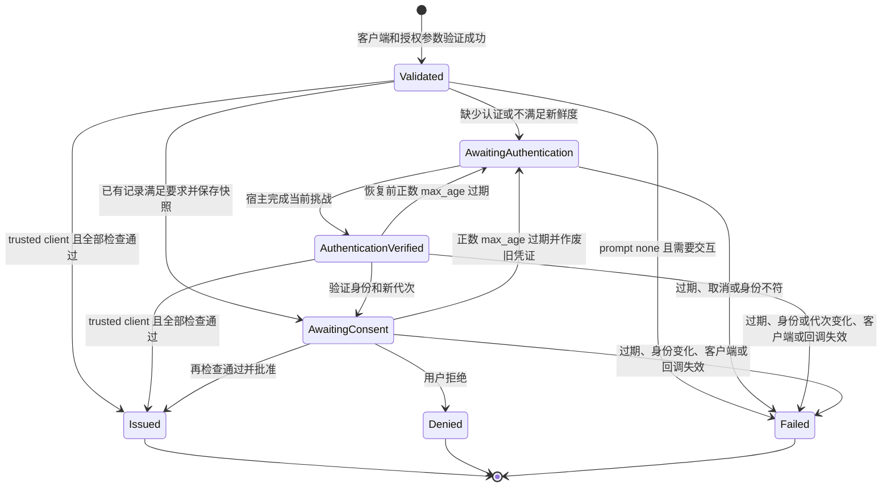

# 2.0.0 OIDC 认证新鲜度设计提案

[English](../authentication-freshness-2.0.md) | [简体中文](authentication-freshness-2.0.md)

> 历史设计基线：`48b01c5`。2.0 扩展包现已完成本地实现；见[实施证据与单列的业务宿主验收](../implementation-2.0.md)及 [2.0 升级指引](upgrading-to-2.0.0.md)。下文保留原提案以便核对。

**状态：拟议中；目标包版本：2.0.0。** 产品要求已确定，下文 API 签名和内部适配方式仍需验证。当前版本行为见 [v1.2.2 升级指引](upgrading-to-1.2.2.md)。

2.0.0 只有一个核心目标：让 `auth_time`、`max_age` 和重新认证反映真实认证事件。包不能从 Laravel `Login` 事件、remember cookie、session 创建时间或 `setUser()` 推断该事件。宿主必须接入显式认证通知与重新认证入口。本包管理的每次授权码事务都要求可信认证记录；认证时间未知时重新认证，`prompt=none` 时返回 `login_required`。

## 范围与术语

- **认证记录：** 保存在服务端 session，绑定 guard、实际模型类、用户 ID、真实认证时间和每次认证更新的随机代次。
- **授权事务：** 一次已验证的 RP 请求，包含原始 nonce、state、PKCE、客户端、回调地址、consent 状态和新鲜度要求。
- **重新认证挑战：** 绑定授权事务和已知原用户的随机、限时、单次挑战。
- **认证代次：** 区分同一秒内两次真实认证的随机值；仅有新代次仍不足以证明完成了本事务挑战。
- **新鲜度检查点：** 展示 consent 或签发 code 前，判断当前证明是否仍满足事务要求的时刻。

本版不做跨模型身份映射、独立 ID Token TTL、新的 consent/logout 开关或无关 Passport 重构。保留现有 code/S256、nonce、身份绑定、默认 consent 和 token 入口安全规则。认证证明只来自宿主显式通知和服务端 session，不依赖进程内对象身份。

## 宿主契约

以下是待验证的方法签名草案：

```php
interface AuthenticationRecorder
{
    public function markAuthenticated(
        string $guard,
        Authenticatable $user,
        ?DateTimeImmutable $authenticatedAt = null,
        ?ReauthenticationChallenge $challenge = null,
    ): AuthenticationRecord;

    public function current(string $guard): ?AuthenticationRecord;

    public function forget(string $guard): void;
}

interface ReauthenticationHandler
{
    public function redirect(
        Request $request,
        ReauthenticationChallenge $challenge,
    ): RedirectResponse;
}

interface ReauthenticationService
{
    public function challenge(
        Request $request,
        string $transactionId,
        string $challengeToken,
    ): ReauthenticationChallenge;

    public function complete(Request $request, ReauthenticationChallenge $challenge): RedirectResponse;
}
```

宿主完成所有必需认证步骤后调用 `markAuthenticated()`；省略 `authenticatedAt` 时，包记录调用时刻。上游 SSO 只可提供经验证的真实认证时间，静默恢复不算新认证。包写入前核对指定 guard 的当前用户。重新认证必须携带本事务挑战；退出登录时清除对应 guard 的记录与未完成事务。

用于完成挑战的认证时间不得早于挑战创建，也不得晚于服务器记录或完成检查的时刻。同秒相等可以接受，但仍须有新代次和本挑战证明。上游断言即使签名有效，只要认证时间早于本挑战，就不能凭 recorder 新生成的代次完成挑战；不得替换成回调接收时间，也不能调整时间来掩盖时钟偏差。

宿主完成挑战的调用顺序示意如下；`hostAuthenticator` 及其结果代表宿主已有的认证实现，不是包提供的 API。结果包含已认证用户和经验证的真实认证时间：

```php
$challenge = $reauthentication->challenge($request, $transactionId, $challengeToken);
$authentication = $hostAuthenticator->authenticateForChallenge($request, $challenge);
$user = $authentication->user;
// 所选认证方式和全部必需因子均已验证成功。
Auth::guard($challenge->guard)->login($user);
$request->session()->regenerate(true);
$recorder->markAuthenticated(
    guard: $challenge->guard,
    user: $user,
    authenticatedAt: $authentication->authenticatedAt,
    challenge: $challenge,
);

return $reauthentication->complete($request, $challenge);
```

宿主入口保留 CSRF 与失败次数限制。`challenge()` 从服务端事务还原 guard、身份和要求；`complete()` 只消费已记录的当前挑战证明，不能替代认证或补写 `auth_time`。用户取消时终止本事务。

## Session 与加密上下文

认证记录和待完成事务以可序列化的值保存在服务端 session，分别按 guard 和随机事务 ID 索引。事务保存原请求、身份约束、新鲜度条件、有效期及一次性挑战、批准和恢复凭证；不保存密码、MFA 密钥或上游断言。没有包认证记录的旧 session，其认证时间未知。

Session 结构示意（字段名仍属于实现设计）：

```json
{
  "oidc": {
    "freshness": {
      "schema": 1,
      "session_binding": "<random>",
      "authentications": {
        "member": {
          "guard": "member",
          "model": "App\\Models\\Member",
          "user_id": "123",
          "auth_time": 1790200000,
          "generation": "<previous-generation>"
        }
      },
      "transactions": {
        "<transaction-id>": {
          "state": "awaiting_authentication",
          "created_at": 1790200010,
          "expires_at": 1790200610,
          "session_binding": "<random>",
          "authorization": {
            "client_id": "<validated-client-id>",
            "redirect_uri": "https://rp.example/callback",
            "response_type": "code",
            "scope": "openid profile",
            "state": "<exact-original-state>",
            "nonce": "<exact-original-nonce>",
            "code_challenge": "<original-S256-challenge>",
            "code_challenge_method": "S256"
          },
          "requirements": { "max_age": 0, "prompts": ["login"] },
          "guard": "member",
          "expected_identity": ["member", "App\\Models\\Member", "123"],
          "expected_subject": "<validated-subject>",
          "baseline_generation": "<previous-generation>",
          "challenge": {
            "id": "<random>", "token_hash": "<hash>",
            "issued_at": 1790200010, "expires_at": 1790200310
          },
          "authentication_snapshot": null,
          "verified_authentication": null,
          "approval_token_hash": null,
          "resume_token_hash": null
        }
      }
    }
  }
}
```

字段名及期限是设计示意。`session_binding` 在 session ID 轮换时保留，但不替代挑战证明。所有事务均记录目标 guard；已有登录用户时，在创建事务时绑定 `expected_identity` 和 `expected_subject`。游客事务的这两个字段暂为 null，首次挑战成功后一次性绑定认证身份，后续切换账户不能替换它们。

`authentication_snapshot` 是 consent 和最终批准所用的唯一认证时间及代次快照。当前记录已经满足要求时，直接复制快照，不创建挑战、不更新时间或代次，`verified_authentication` 保持 null。挑战完成后的 `verified_authentication` 仅包含 `{challenge_id, generation}`：挑战 ID 必须对应本事务的当前挑战，代次必须同时匹配快照和目标 guard 的当前认证记录，不再复制时间或身份。两条路径在签发 code 前都必须有非空快照，挑战路径还必须有匹配的证明。批准和恢复凭证各只可消费一次。事务及并发数量须设上限，实际数值由实现验证。

加密上下文使用内部格式标识 `oidc.v=3`，本次发布仅接受整数 `3`；标识缺失、值不同或类型不符（包括字符串 `"3"`）均返回 `invalid_grant`。该标识用于确定数据的解释规则，不是认证证明。验证密文完整性并解密后，即使标识正确，仍须严格校验允许的键、必填字段、类型及身份绑定。不增加旧格式解析器、格式转换或版本协商。

上下文仅携带原始 nonce、绑定的身份/client/issuer/subject，以及已验证认证事件的 `auth_time` 和代次。授权要求、事务 ID、挑战证明和新鲜度检查留在服务端签发流程，不作为没有实际用途的审计字段或派生成功标记复制到 refresh token。只有通过检查的签发路径才能创建该上下文；额外字段须证明有明确校验用途后才加入。

上述挑战完成后的 `oidc` 上下文示意：真实认证发生于 `1790200012`，产生新代次，最终授权检查发生于 `1790200015`。

```json
{
  "v": 3,
  "nonce": "<original-nonce-or-null>",
  "identity": ["member", "App\\Models\\Member", "123"],
  "client_id": "<validated-client-id>",
  "iss": "https://op.example",
  "sub": "<validated-subject>",
  "authentication": { "auth_time": 1790200012, "generation": "<new-generation>" }
}
```

已签发材料中的 `authentication`、`auth_time` 和 `generation` 均不可缺失或为 `null`。session 中待完成事务的 `authentication_snapshot` 可暂为空；需要认证的事务还须取得非空 `verified_authentication`，才可签发 code。直接复用已经满足要求的记录时，不要求也不伪造挑战证明。

认证事件在签发 code 时冻结，refresh 轮换时原样保留。token 请求不能提交或替换时间、代次、身份、nonce。code 兑换和 refresh 不读取当前浏览器 session，也不以当前时刻重新执行原请求的 `max_age`；它们校验加密上下文及 code/refresh 自身的到期、撤销、客户端和身份规则。refresh 产生的新 ID Token 采用原始 `auth_time`、新的 `iat`，不包含 `nonce`；原 nonce 可以留在加密上下文内，但不作为 ID Token claim 或 token 响应明文字段返回。

本包管理的授权码事务签发的 code 及其 refresh token 统一携带该认证上下文。本包 token 入口对 `authorization_code` 和 `refresh_token` 均要求此上下文，不因缺少 `openid` 豁免；返回的 ID Token 必须包含真实 `auth_time`。其他 grant 不能仅凭请求 `openid` 获得认证事务或 ID Token。

| Grant 或入口 | 本版范围 |
| --- | --- |
| 授权码及其 refresh，含或不含 `openid` | 均要求统一认证契约及上下文；无 `openid` 时仅返回 OAuth token，但仍校验上下文。 |
| `client_credentials` | 保留 OAuth 客户端认证，不要求用户 session 或认证事件；不返回 ID Token。 |
| Passport personal access token factory | 继续由宿主管理，不纳入浏览器认证契约；不增加 ID Token 或 session 要求。 |
| 没有本包授权事务的 password、device 或自定义用户 grant | 2.0.0 不为这些 grant 新增新鲜度接入；本包 token 入口在签发前返回 `unsupported_grant_type`，避免返回该入口随后必拒的无上下文 refresh。宿主如保留这些流程，须使用独立配置的 OAuth server 和入口，自行管理签发及刷新策略。 |

保留的 Passport 别名遵守同一本包策略；仅增加 URL、仍使用同一受保护 server，不构成独立 OAuth 接入。本包入口收到任何旧或无上下文的 code/refresh，仍返回 `invalid_grant`；宿主边界不构成旧材料兼容分支。

同宿主内的 OAuth 隔离须在两个 Passport 版本上验证具体接入方式。当前 provider 使用全局 Passport response 设置和 `afterResolving(AuthorizationServer::class)`，另绑容器服务名或使用子类仍可能受到包配置影响。第一阶段原型必须隔离 controller 路由、server 实例、grant 注册及 response 类型，并证明本包入口的检查仍然有效。验证前不能把第二套入口/server 写成已经可用的接入方式，也不为此建设通用多 server 框架。

## 授权时序

1. 先验证 client、注册回调、response type、scope 和 S256，再决定是否向回调返回错误或创建事务。解析 OIDC 参数时保留 nonce/state 的原值，拒绝重复参数、归一化别名、非法 `max_age` 和错误的 prompt 组合。
2. 为已验证请求和目标 guard 创建事务，再选择认证路径。已有用户时绑定其身份及 subject。检查 guard 的显式记录：记录缺失、记录与当前用户不符或认证年龄超过请求上限时需要认证；没有 `max_age` 也不能跳过检查。`prompt=login` 和 `max_age=0` 要求本事务新完成的挑战，即使当前记录也在同一秒写入。`prompt=none` 时，如需要交互则返回 `login_required` 或 `consent_required`，不创建挑战。
3. 记录已经满足要求时，保存其认证快照，直接进入步骤 5 的 consent 判断；否则生成随机挑战并跳转宿主 handler。浏览器仅携带不透明的事务/挑战定位值；宿主不能改变最终回调或授权参数。
4. 宿主真实认证成功后，保留其他 guard，轮换 session，携带本挑战调用 `markAuthenticated()`，再调用完成方法。已有绑定用户必须保持同一身份；游客事务一次性绑定首次成功的身份及 subject。包校验事务、guard、身份、挑战、有效期、新代次和认证时间顺序，消费挑战，保存认证快照及其挑战证明，再跳至包控制的恢复路由。
5. 使用或恢复原事务，按已有策略取得 consent。在恢复时及紧邻 code 签发前，重新确认 client 仍有效且原始精确回调仍在注册列表中；任一检查失败均在本地终止事务，不能向已移除的回调发送 code 或错误。可信客户端仍可明确跳过 consent，但不能跳过这些检查或新鲜度。签发 code 前，将当前身份/代次与快照比较，重新计算正数 `max_age`，防止 consent 等待使认证过期。已满足的 `prompt=login` 或 `max_age=0` 不能跳过后续检查。
6. 本包入口处理授权码兑换或 refresh 时，须在创建 Access Token、Refresh Token 或 ID Token 前验证上下文。继续使用 League 的客户端认证、回调、verifier、过期和撤销检查。验证 refresh 上下文必须早于撤销旧 refresh 或保存新 token。其他 grant 按上表的范围处理。

`Issued`、`Denied`、`Failed` 是终态，不能再次消费挑战或批准凭证：



恢复前或等待 consent 时正数 `max_age` 过期，可在事务有效期内发起新挑战；事务已过期则由 RP 重新授权。进入新挑战时，立即作废上一轮挑战、批准和恢复凭证，清除旧认证快照及证明，并记录当前基线代次，不延长事务有效期。完成后保存新快照，重新展示所需 consent，并签发绑定新快照的批准凭证；旧表单在新认证前后提交均须失败。

不会仅因请求仍包含已经满足的 `max_age=0` 或 `prompt=login` 而再次挑战；正数 `max_age`、事务有效期以及身份/代次检查仍须通过。例如 `prompt=login&max_age=60` 在认证完成后等待 consent 超过 60 秒，仍须再次认证。

| 请求 | 必须遵守的行为 |
| --- | --- |
| 无 freshness 参数，时间已知 | 按正常 consent 策略处理，初次 ID Token 使用真实 `auth_time`。 |
| 无 freshness 参数，时间未知 | 先完成真实认证，再执行 consent；`prompt=none` 时返回 `login_required`。 |
| `max_age=N` 且 N>0 | 真实认证年龄不超过 N 才可继续，签发 code 时仍须成立；否则主动重新认证。 |
| `max_age=0` 或 `prompt=login` | 要求满足本事务挑战的新认证；同秒以代次区分。 |
| `prompt=login` 与正数 `max_age` 同时出现 | 两项要求都须满足；已完成登录挑战不能豁免恢复或签发 code 时的年龄检查。 |
| `prompt=login consent` | 完成本事务重新认证后仍须展示 consent。 |
| `prompt=consent` | 要求 consent，本身不产生新认证时间。 |
| `prompt=none` 且需要认证，包括 `max_age=0` | 不交互，返回 `login_required`。 |
| `prompt=none` 且需要 consent | 不交互，返回 `consent_required`。 |
| `prompt=none` 与其他 prompt 同时出现 | 返回 `invalid_request`。 |
| 请求 ID Token Essential `auth_time` | 按统一认证契约返回真实时间；未知时先认证，若禁止交互则返回 `login_required`。 |
| 超过原 `max_age` 后兑换 code 或 refresh | 不重新执行该年龄限制；校验上下文及凭证自身的到期、撤销和绑定规则。 |
| 带可证明时间的 refresh | 保留原始 `auth_time`，使用新 `iat`，省略 nonce。 |

格式错误、负数、小数、空值、重复或溢出的 `max_age` 均非法。接受可表达的非负十进制整数，包括前导零。不支持的 `auth_time` claim 限定条件不能导致伪造或修改真实时间；其接受语法和行为在第一阶段原型中固定。

## 重放、并发与失败

每个标签页有独立事务，不能混用 nonce、state、PKCE、consent 或挑战。新认证代次可能使另一个标签页原 consent 判断失效；该标签页须重新判断或重启，不能借用其他事务的证明。待完成事务不能更换已绑定的 guard、模型、ID 或 subject。code 签发后，浏览器切换账户、退出或丢失 session，不改变其原始身份。兑换仍须核对原用户存在、模型及 subject 未变，且服务器 issuer/guard/provider 映射与加密绑定一致；不符时 code/refresh 返回 `invalid_grant`。

授权、恢复、批准、拒绝和宿主认证完成路径使用共享 session 存储及 session blocking。Laravel 的 session 锁以 session ID 为键，必须测试 ID 轮换前的请求和延迟保存。必要时给挑战完成与事务签发加入范围有限的原子消费标记，阻止旧 session 快照重复消费。token 兑换的串行化须覆盖 League 检查、持久化和撤销，而非仅覆盖中间件预检查。必要锁不可用时，停止签发。

取得锁也不代表整个请求期间都持有锁：租期可能在请求结束前到期。实现必须保证临界区内持续互斥，或通过原子消费阻止失去锁后的重复推进，具体机制须经原型验证。消费标记须覆盖相关材料的可重放窗口；独立进程测试要注入租期到期、标记过早失效或丢失、消费后节点中止等故障。无法确认必需存储或消费保证时，停止签发，不能把缺失状态当作凭证尚未使用。

| 失败点 | 可观察结果与边界 |
| --- | --- |
| client 或回调尚未验证 | 本地协议错误；不得重定向到请求提供的地址。 |
| 认证或 consent 等待期间 client 被撤销或原回调被移除 | 恢复或批准在本地失败，不向已移除回调发送 code 或错误。 |
| 挑战、恢复或批准凭证错误 | 本地拒绝；不能使用提交的回调，也不能删除其他标签页事务。 |
| session 或事务丢失、已过期 | 要求 RP 重新授权；只有仍有可信原事务时才向其已验证回调返回错误。 |
| 浏览器用户改变或 session 结束 | 待完成事务不能换用户或在 session 丢失后继续；已签发 code 不依赖该浏览器 session，但仍校验原始身份。 |
| 原用户被删除、模型/subject 改变，或服务器 issuer/guard/provider 映射不再匹配 | 终止受影响的待完成事务；code/refresh 在签发 token 或撤销 refresh 前返回 `invalid_grant`。 |
| 认证时间在未来或节点时钟异常 | 不能把负年龄视作零年龄；拒绝该新鲜度证明。 |
| 上报认证时间早于本次挑战 | 即使有新代次也拒绝完成挑战，不改写时间。 |
| 必需的共享锁不可用 | 停止签发，不退化为无锁流程。 |
| code/refresh 为旧格式、缺少认证证明、损坏或身份不符 | `invalid_grant`；校验发生在新 token 持久化和 refresh 撤销前。 |
| 宿主未配置重新认证 handler | 返回接入错误；不能退回可能清空共享 session 的 Passport 原生 `prompt=login`。 |

## 升级与切换

2.0.0 采用新的认证契约，不提供旧授权材料的转换或兼容刷新分支。宿主须完成新接入；RP 收到旧材料的 `invalid_grant` 后重新发起授权。

| 材料或会话状态 | 2.0.0 行为 |
| --- | --- |
| 没有可信认证记录的旧 session 或 remember 恢复 | 在新的授权事务中完成真实认证；不推断或补造原认证时间。 |
| v1.2.2 待同意页面 | 重新开始授权，不转换旧 pending 状态。 |
| 本包入口收到旧授权码或旧 refresh token，包括缺少新认证上下文的材料 | `invalid_grant`；不签发替换 token，由 RP 重新授权。 |
| 当前格式，但认证时间或代次缺失、为空或不合法 | `invalid_grant`；不得签发任何 token。 |
| 携带合法当前上下文的 code/refresh | 按新契约兑换或刷新；返回 ID Token 时使用原始 `auth_time`，refresh 省略 nonce。 |
| 未知格式或损坏的上下文 | `invalid_grant`；不按旧格式或无上下文材料放行。 |
| 已签发 Access Token / ID Token | 部署不会自动撤销，仍受原到期和撤销规则约束。 |

默认不增加数据库迁移。切换前部署宿主认证通知和重新认证入口，确认 RP 能在 `invalid_grant` 后重新授权；排空旧授权/token 请求，再整体切换节点，禁止新旧 worker 混跑。同步共享 session/锁、密钥、时钟、已发布视图、路由/配置缓存及长驻进程。正式升级指引须写明本次重新认证、授权要求及上述 grant 边界。

回滚也须排空签发并整体切换。退回 v1.2.2 不仅无法读取新上下文，还会失去认证新鲜度能力：v1.2.2 拒绝 `max_age` 和 Essential `auth_time` 请求，也不返回可信认证时间。依赖这些保证的 RP 无法仅靠重新授权恢复服务。优先前向修复；回滚期间明确停止受影响流程，不能删除新鲜度要求或改写上下文版本来放行。持有不可读材料的 RP，须在具备相应能力的服务恢复后才能重新授权。

格式拒绝不会撤销数据库中的 token 记录。回滚后如果重新开放旧 token 入口，仍有效且未撤销的旧 refresh 可能重新可用。因此回滚门禁必须同时覆盖受影响客户端的新授权和旧 refresh 重试；演练保留一个未撤销的旧格式样本，验证门禁关闭期间不会签发 token。若要求永久失效，须另行授权撤销操作，不能认为部署已经完成了撤销。

| 边界 | 已知差异与拟议处理 |
| --- | --- |
| Passport 12/13 授权控制器 | 构造与 `authorize()` 签名不同；包统一编排事务，避免继承不稳定的父方法。 |
| 待批准请求及当前用户 | Passport 12/13 的 session 存法与 approve 取用户方式不同；包存标量事务并显式使用目标 guard。 |
| `prompt=none` | Passport 12/13 原生错误不同；包统一为认证不足时 `login_required`、consent 不足时 `consent_required`。 |
| League 8/9 | grant、加解密与 response 类型签名须分别校验；上下文检查必须位于发放和撤销之前。 |
| 宿主 OAuth 隔离 | 在 Passport 12/13 下验证 controller/server/grant/response 不受全局 hook 干扰后，才能公布受支持接入方式。 |
| 支持组合 | Laravel 11/12 配 Passport 12/13；Laravel 13 配 Passport 13。PHP 版本按各组合的 Composer 约束核对。 |

## 实施阶段与验收门槛

主要归属边界：现有的 `AuthorizationContext` 负责参数及上下文校验，`AuthorizationController` 负责授权、consent 和恢复，`EnforceAuthorizationPolicy` 负责入口保护，`Bridge/AuthCodeGrant` 负责 code 上下文与签发前检查，`TokenResponseType` 和 `IdTokenService` 负责 refresh 上下文与 ID Token claim，`OidcServerServiceProvider` 负责注册。新增聚焦的认证记录、事务存储、重新认证服务和 refresh grant 适配。包路由和 consent 视图须传递事务，不能接受替换后的授权参数。保留的 Passport 授权/token 别名也必须采用同一保护规则。

第一阶段原型应在调用父 grant 的 `completeAuthorizationRequest()` 前完成最终事务及挑战检查，因为 League 在 `encrypt()` 前已经保存 code。兑换侧验证 code 解密 hook，以及调用父 `validateOldRefreshToken()` 后的校验 hook，同时核对 Passport/League 签名和 `invalid_grant` 异常映射。将校验结果保存在请求内供响应生成使用；响应加密和 ID Token 生成只消费该结果，不把已知坏上下文的失败推迟到 token 持久化或 refresh 撤销之后。这不承诺后续签名、进程或传输失败时自动回滚全部操作。

| 阶段 | 主要范围 | 完成条件 | 主要风险 |
| --- | --- | --- | --- |
| 1. 验证契约和扩展点 | API/上下文草案、Passport 12/13、League 8/9 的控制器与 grant/response 方法 | 原型证明坏上下文在持久化/撤销前被拒绝、错误映射正确，并验证宿主 OAuth 隔离方式。 | 校验位置太晚、签名不兼容或全局 hook 破坏隔离。 |
| 2. 记录真实认证 | 宿主契约、session recorder、guard 生命周期 | 密码/SSO/MFA、remember 恢复、同秒代次及 Member/Admin 隔离测试通过。 | 把框架登录误记为真实认证。 |
| 3. 绑定事务 | 事务存储、handler、挑战完成、session 轮换 | 快照及游客绑定正确；错身份/事务、重放、过期、旧 session ID、锁租期到期和消费标记丢失均安全失败。 | 并发消费或旧 session 快照重复签发。 |
| 4. 执行新鲜度 | authorize/approve/deny/continue、consent 视图、策略中间件 | login/年龄组合、consent 等待及 client/回调复核通过；重新认证使旧表单失效；可信客户端不能绕过检查。 | 入口中间件先重定向，或使用已失效认证及注册信息签发。 |
| 5. 统一新上下文 | 授权码、refresh grant、response、ID Token 服务 | 含或不含 `openid` 的新格式兑换及刷新通过；旧材料及缺少证明的材料在签发前被拒绝；其他 grant 遵守范围表。 | 校验前已有副作用、旧材料被放行或签发不可用 refresh。 |
| 6. 清理与接入边界 | logout、Discovery、手工配置和保留的 Passport 路由 | 按 guard 清理认证记录；全部别名遵守相同策略。 | 清除 Admin 状态或留下绕过入口。 |
| 7. 真实集成 | Laravel/Passport 矩阵、真实宿主、独立 RP、并发进程 | 支持组合、真实 RP 和跨节点故障注入均通过，包括锁租期到期及消费后节点中止。 | 测试替身掩盖 session、SSO 或竞争行为。 |
| 8. 迁移与发布准备 | 中英文文档、宿主/RP 接入、协同切换与回滚演练 | RP 在 2.0.0 能重新授权；回滚门禁阻止依赖新鲜度的流程和未撤销旧 refresh 的重试。 | 将重新授权误当作能力恢复，或回滚后旧材料重新可用。 |

测试随对应阶段提交。并发验收使用独立进程；顺序请求测试不足以证明防重放。

| 层级 | 必须通过的可验证场景 |
| --- | --- |
| Unit | 不调用 recorder 时无认证证明；同秒认证代次不同；挑战证明引用快照代次，不重复保存时间/身份。格式标识缺失、非整数、旧值或未知值均失败；即使标识正确，多余或非法字段、身份错配也须失败。正数 `max_age` 边界和零年龄挑战按规则判断。 |
| Feature：授权 | 缺少可信记录的旧 session/remember 恢复，即使不带 `max_age` 也不能直接获 code；未知认证时间遇 `prompt=none` 返回 `login_required`。正常恢复的有效认证记录保留原时间和代次。密码、MFA、consent 等待过期、trusted client、身份切换、多标签页及 CSRF 按约定处理。 |
| Feature：事务生命周期 | 可信记录足够时直接保存快照、不发挑战；游客首次成功后一次性绑定身份。`prompt=login&max_age=60` 在 consent 等待期间按时过期。新挑战使旧批准/恢复凭证立即失效，包括完成后才首次提交的旧表单。挑战完成后事务过期或身份/代次变化均阻止签发。 |
| Feature：注册信息变化 | 认证或 consent 等待期间撤销 client 或移除原回调；恢复和最终批准在本地失败，包括 trusted client 自动签发路径，不向已移除回调发送 code 或错误。 |
| Feature：令牌 | 浏览器退出或换人后，无 session 兑换在原身份映射有效时仍保留原 nonce/身份/时间；原用户被删除或模型/subject/issuer/guard/provider 不符时返回 `invalid_grant`。连续 refresh 保留 `auth_time` 且无 nonce。旧/无上下文 code/refresh 或认证字段为空时不新增 token、不撤销有效 refresh。无 `openid` 的新材料仍校验上下文，但不返回 ID Token。 |
| Feature：签发后的认证年龄 | `max_age=60`，认证后第 59 秒签发 code，第 65 秒兑换，一小时后 refresh；只要各凭证自身期限和绑定有效，均应成功并保留原 `auth_time`，不能把授权年龄上限当成 refresh TTL。 |
| Feature：grant 边界 | client credentials 和宿主 personal access token 不要求浏览器认证记录，也不返回 ID Token。不支持的 password/device/自定义用户 grant 在本包别名入口签发前失败。两个 Passport 版本上，文档提供的宿主 OAuth 接入方式均须使 controller/server/grant/response 不受全局 hook 干扰，同时保留本包 code/refresh 检查。 |
| 真实宿主 | 同浏览器 Member 重新认证后 Admin 仍登录。挑战在时刻 200 创建，不能用已验证但时间为 100 的上游事件加新代次完成；同秒事件仍须证明属于本挑战。SSO 静默恢复和未完成 MFA 均失败。旧 ID 请求、临界区超过锁租期、消费标记过早丢失及消费后节点中止，均不能导致重复完成、签发或兑换。 |
| 独立 RP | 使用真实客户端库验证 Discovery、S256、state/nonce、JWT、正数与零 `max_age`、静默失败和 refresh 时间；旧 refresh 被拒后能重新授权，取得带真实认证时间的新 ID Token。 |

## 全面实现前须验证的技术假设

- 包控制器能否不继承 Passport 的版本相关方法签名，同时覆盖所有保留的授权别名？
- 拟议的父 complete 调用前、code 解密及父 refresh 校验后的 hook，在 League 8/9 下是否保持签名和 `invalid_grant` 映射，并使响应仅消费请求内已验证上下文？
- 不引入通用多 server 框架时，宿主 OAuth 的 controller/server/grant/response 配置能否在两个 Passport 版本上均不受本包全局 hook 干扰？
- 标量事务能否准确重建默认 scope、精确回调、nonce/state 和 S256，而不保存序列化 League 对象？
- 哪种 session 锁与一次性标记组合能防住 `regenerate(true)` 前旧 ID 的并发请求，并覆盖租期到期、标记过早丢失及消费后进程中止？
- 目标 SSO 集成能否以允许时间区间内的可信时间，证明为本挑战主动完成了认证，而非静默恢复更早的事件？
- 在保持真实时间不可修改的前提下，应接受哪些 `auth_time` claim 限定语法？
- 长驻宿主进程复用 Passport/League 服务时，请求级值是否完全隔离？

认证/挑战绑定、签发前校验与 session 轮换防重放属于 2.0.0 发布阻断项。
